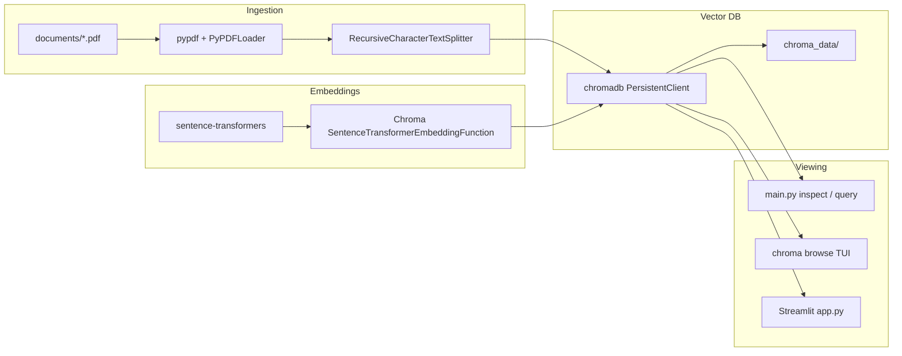

# vector-db-setup

Local PDF ingestion pipeline with persistent vector storage and multiple ways to inspect and search your data. Drop PDFs into `documents/`, embed them with a sentence-transformer model, store chunks in [ChromaDB](https://www.trychroma.com/), then browse or query via CLI, Streamlit, or Chroma's built-in TUI.

## High-level overview

This project is a minimal **retrieval-oriented vector database** for PDF documents:

1. **Ingest** — PDFs are parsed, split into overlapping text chunks, embedded, and upserted into a local Chroma collection.
2. **Store** — Vectors and metadata persist on disk under `chroma_data/` (SQLite + segment files).
3. **Query** — Natural-language search returns the most similar chunks by cosine distance in embedding space.
4. **View** — Inspect counts, peek at raw records, or run semantic search through the CLI, Streamlit app, or `chroma browse`.

There is no LLM chat layer, API server, or cloud dependency. Everything runs locally with `uv`.



## Project structure

```
vector-db-setup/
├── documents/          # Place PDFs here (user-supplied)
├── chroma_data/          # Persisted Chroma DB (generated at runtime)
├── config.py             # Paths, collection name, model, chunk settings
├── db.py                 # Chroma client, embedding function, collection helpers
├── ingest.py             # PDF load → chunk → upsert pipeline
├── main.py               # CLI: ingest | inspect | query
├── app.py                # Streamlit viewer (stats, search, peek)
├── pyproject.toml        # Dependencies (managed with uv)
└── uv.lock               # Locked dependency versions
```

| Module | Responsibility |
|--------|----------------|
| `config.py` | Single source of truth for paths and tuning constants |
| `db.py` | `PersistentClient`, embedding function, `get_or_create_collection` |
| `ingest.py` | Scan PDFs, chunk text, assign IDs/metadata, `collection.upsert` |
| `main.py` | Argparse CLI wrapping ingest and Chroma read APIs |
| `app.py` | Streamlit UI over the same collection and ingest function |

## Stack and package roles

| Package | Locked version | Role |
|---------|----------------|------|
| **chromadb** | 1.5.9 | Local persistent vector DB (`PersistentClient`, collections, query/get/peek) |
| **langchain** | 1.3.10 | Brings in `langchain-text-splitters` for document chunking |
| **langchain-community** | 0.4.2 | `PyPDFLoader` for PDF ingestion |
| **pypdf** | 6.13.3 | PDF parsing backend used by `PyPDFLoader` |
| **sentence-transformers** | 5.6.0 | Local embedding model via Chroma's `SentenceTransformerEmbeddingFunction` |
| **streamlit** | 1.58.0 | Web UI for stats, semantic search, and record peek |
| **torchvision** | 0.27.1 | Transitive dependency (PyTorch ecosystem) |

### Design choices

- **ChromaDB directly** — Storage and query use the Chroma Python client, not `langchain_community.vectorstores.Chroma` (deprecated in LangChain 1.x). This avoids extra partner packages (`langchain-chroma`, `langchain-huggingface`).
- **LangChain only for I/O and splitting** — PDF loading (`PyPDFLoader`) and `RecursiveCharacterTextSplitter` are the only LangChain touchpoints.
- **Upsert semantics** — Re-running ingest updates existing chunk IDs in place rather than duplicating them.
- **Constants over env vars** — All configuration lives in `config.py` for v1 simplicity.

## Low-level details

### Ingestion pipeline

For each `documents/*.pdf` file:

1. **Load** — `PyPDFLoader` reads the PDF page-by-page; each page becomes a LangChain `Document` with `metadata["page"]`.
2. **Split** — `RecursiveCharacterTextSplitter` breaks text into chunks of ~1000 characters with ~200-character overlap so context isn't lost at boundaries.
3. **Identify** — Each chunk gets a stable ID: `{filename}::page_{n}::chunk_{i}` (e.g. `paper.pdf::page_2::chunk_12`).
4. **Metadata** — Per chunk: `source` (filename), `page` (0-based page index from PyPDF).
5. **Embed + store** — `collection.upsert(ids, documents, metadatas)`; Chroma embeds text automatically using the collection's attached embedding function.

### Embedding model

- **Model:** `all-MiniLM-L6-v2` (384-dimensional vectors)
- **Provider:** `chromadb.utils.embedding_functions.SentenceTransformerEmbeddingFunction`
- **First run:** The model is downloaded from Hugging Face Hub (~90 MB). Subsequent runs use the local cache.
- **Query-time:** The same model embeds query strings, so `query_texts=[...]` works without manual vector math.

### Chroma persistence

- **Client:** `chromadb.PersistentClient(path="chroma_data")`
- **Collection:** `pdf_documents` (created on first access via `get_or_create_collection`)
- **On disk:** SQLite catalog (`chroma.sqlite3`) plus UUID-named segment directories for vector/index data
- **Distance:** Lower distance = more similar (Chroma default for this setup)

### Chunk ID and upsert behavior

Chunk IDs are deterministic from filename, page, and chunk index. Re-ingesting the same PDF with unchanged chunking settings overwrites the same IDs. Adding new PDFs appends new IDs. Changing `CHUNK_SIZE` / `CHUNK_OVERLAP` or editing a PDF will produce different chunk boundaries and IDs.

## Configuration

All settings are in `config.py`:

| Constant | Default | Description |
|----------|---------|-------------|
| `DOCUMENTS_DIR` | `documents/` | Folder scanned for `*.pdf` |
| `CHROMA_DIR` | `chroma_data/` | Chroma persistence directory |
| `COLLECTION_NAME` | `pdf_documents` | Chroma collection name |
| `EMBEDDING_MODEL` | `all-MiniLM-L6-v2` | Sentence-transformers model name |
| `CHUNK_SIZE` | `1000` | Target characters per chunk |
| `CHUNK_OVERLAP` | `200` | Overlap between consecutive chunks |

## Prerequisites

- **Python** 3.12+
- **[uv](https://docs.astral.sh/uv/)** — dependency and virtualenv management

## Setup

```bash
cd vector-db-setup
uv sync
```

## Usage workflow

### 1. Add PDFs

Copy PDF files into `documents/`:

```bash
# example
cp ~/papers/*.pdf documents/
```

### 2. Ingest

```bash
uv run python main.py ingest
```

Example output:

```
  attention-is-all-you-need.pdf: 52 chunks
  ...

Processed 5 file(s), upserted 798 chunk(s).
Collection total: 798 record(s).
```

If `documents/` is empty, ingest prints a helpful message and exits without error.

### 3. Inspect (CLI)

```bash
uv run python main.py inspect
```

Shows collection name, DB path, record count, and a peek at the first 5 chunks (source, page, text preview).

### 4. Query (CLI)

```bash
uv run python main.py query "attention mechanism"
uv run python main.py query "transformer architecture" -n 10
```

Returns ranked chunks with distance, source PDF, page number, chunk ID, and full text.

### 5. Streamlit viewer (primary UI)

```bash
uv run streamlit run app.py
```

| Area | Features |
|------|----------|
| **Sidebar** | DB path, collection name, document count, **Re-ingest PDFs** button, search box, results slider (1–20) |
| **Search tab** | Semantic search results as expandable cards (source, page, distance, chunk text) |
| **Peek tab** | Raw table of first N records via `collection.get()` |

The collection is cached with `@st.cache_resource`; re-ingest clears the cache and refreshes the page.

### 6. Chroma TUI (optional)

Chroma ships a terminal browser:

```bash
uv run chroma browse pdf_documents --path ./chroma_data
```

Useful for low-level inspection of collections, segments, and records outside this project's UI.

## CLI reference

```
usage: main.py [-h] {ingest,inspect,query} ...

positional arguments:
  {ingest,inspect,query}
    ingest              Load PDFs from documents/ into Chroma
    inspect             Show collection stats and peek records
    query               Semantic search over ingested chunks

query options:
  -n, --n-results N     Number of results (default: 5)
```

## Troubleshooting

| Issue | What to do |
|-------|------------|
| **No PDFs found** | Ensure files are in `documents/` with `.pdf` extension (case-sensitive glob). |
| **Empty collection after ingest** | Check ingest output for errors; confirm PDFs are not encrypted or image-only scans without OCR. |
| **Slow first ingest/query** | Expected — `all-MiniLM-L6-v2` downloads and loads on first use. |
| **HF Hub rate-limit warning** | Harmless for local use; set `HF_TOKEN` for higher limits if needed. |
| **Permission errors on `chroma_data/`** | Ensure the process can write to the project directory; delete `chroma_data/` to reset the DB if corrupted. |
| **Stale Streamlit data after ingest** | Use **Re-ingest PDFs** in the sidebar (clears cache) or restart the Streamlit process. |
| **Re-ingest changed chunk counts** | Normal if you changed chunk settings or edited PDFs; old IDs not present in the new run remain in the DB until manually deleted. |

## Resetting the database

To start fresh, stop any running processes and remove the persisted data:

```bash
rm -rf chroma_data/
```

The next `ingest` or `get_collection()` call recreates the collection.

## Related concepts

- **RAG (Retrieval-Augmented Generation)** — This project implements the *retrieval* half: chunking, embedding, and similarity search. A separate LLM would consume retrieved chunks as context.
- **Vector similarity search** — Queries are embedded into the same space as document chunks; nearest neighbors approximate semantic relevance.
- **Chunking trade-offs** — Larger chunks preserve context but reduce precision; overlap reduces the risk of splitting mid-sentence or mid-idea.
